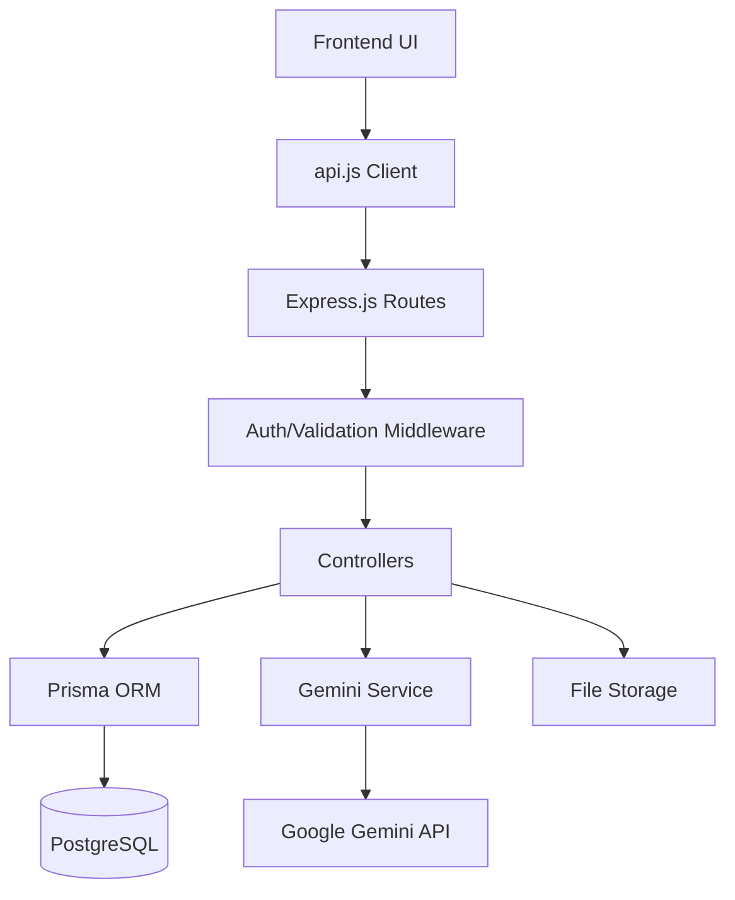
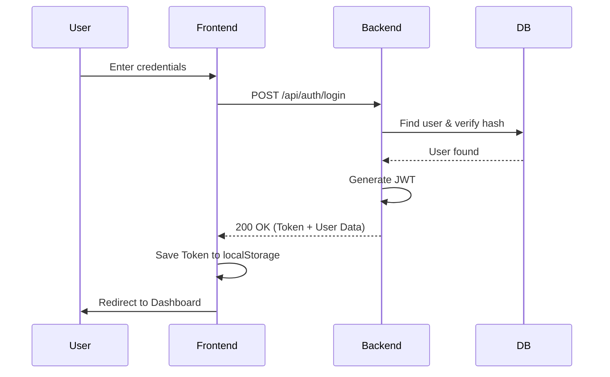
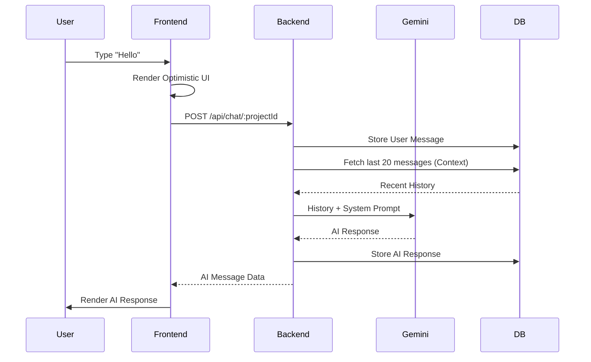

# Project Architecture

This document provides a detailed overview of the ChatBot Platform's architecture, including its components, data flow, and technology choices.

## System Overview

The ChatBot Platform is a full-stack application designed to allow users to create, manage, and interact with AI-powered chatbot agents. These agents utilize the Gemini API to provide intelligent responses based on custom system prompts and user-uploaded knowledge bases.

## Technology Stack

### Frontend
- **Language:** HTML5, CSS3, Vanilla JavaScript
- **Styles:** Custom CSS3 with modern design principles (glassmorphism, micro-animations)
- **Networking:** Fetch API with a centralized `api.js` client
- **Authentication:** JWT (JSON Web Tokens) stored in `localStorage`

### Backend
- **Environment:** Node.js
- **Framework:** Express.js (Handles routing and HTTP request lifecycle)
- **Database ORM:** Prisma (Provides type-safe database access and automated migrations)
- **Database:** PostgreSQL (Primary persistent storage for users, projects, and chats)
- **AI Integration:** `@google/generative-ai` (Google's official SDK for interacting with Gemini models)
- **File Handling:** `multer` (Middleware for handling `multipart/form-data`, used for file uploads)
- **Middleware & Utilities:** 
  - `jsonwebtoken`: Used for generating and verifying stateless user sessions.
  - `bcryptjs`: Securely hashes passwords using salted rounds for database storage.
  - `cors`: Configures cross-origin resource sharing so the frontend can securely call the API.
  - `compression`: Implements GZIP/Deflate compression for all HTTP responses to reduce latency.
  - `dotenv`: Loads environment-specific variables (API keys, DB URLs) from a `.env` file.

## Architecture Components

### 1. Unified API Client (`frontend/js/api.js`)
All communication from the frontend to the backend flows through a single `api` object. This ensures consistent error handling, automatic JWT attachment to headers, and centralized base URL management.

### 2. Centralized Database Proxy (`backend/src/lib/prisma.js`)
A single, shared instance of the `PrismaClient` is exported. This optimizes connection pooling and ensures that the application doesn't exceed database connection limits during heavy usage.

### 3. Service Layer (`backend/src/services/geminiService.js`)
Abstracts the complexity of interacting with the Google Generative AI SDK. It handles model initialization, conversation history formatting, and robust error management for the AI responses.

### 4. Controller Pattern
The backend logic is separated into controllers (`auth`, `chat`, `project`, `file`), ensuring each module has a single responsibility.

## Data Flow

## Project Flows

### 1. Authentication Flow
This flow ensures secure access to personal projects and chat history.

### 2. AI Chat & Context Flow
This is the core loop where user input is combined with historical context and sent to Gemini.

## Key Infrastructure Features

- **Database Indexing:** Foreign keys (`userId`, `projectId`) are indexed in the Postgres database for sub-millisecond query performance.
- **Payload Optimization:** Responses are GZIP-compressed dynamically, reducing bandwidth usage by up to 70-80%.
- **Cascade Deletion:** Project deletion automatically triggers the cleanup of all associated messages and files via Prisma's referential integrity.
